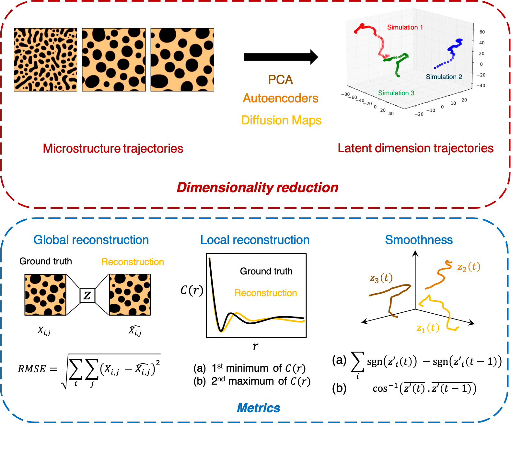

Introduction
------------------------------------------
Title: Python codes the paper - "Trade-offs in the latent representation of microstructure evolution" 
Institution: Sandia National Laboratories
Authors:
- Saaketh Desai
- Ankit Shrivastava
- Remi Dingreville

Funding Statement:
The authors acknowledges funding under the BeyondFingerprinting Sandia Grand Challenge Laboratory Directed Research and Development (GC LDRD) program. The phase-field capability is being developed and supported by the Center for Integrated Nanotechnologies, an Office of Science user facility operated for the U.S. Department of Energy. This article has been authored by an employee of National Technology \& Engineering Solutions of Sandia, LLC under Contract No. DE-NA0003525 with the U.S. Department of Energy (DOE).The employee owns all right, title and interest in and to the article and is solely responsible for its contents. The United States Government retains and the publisher, by accepting the article for publication, acknowledges that the United States Government retains a non-exclusive, paid-up, irrevocable, world-wide license to publish or reproduce the published form of this article or allow others to do so, for United States Government purposes. The DOE will provide public access to these results of federally sponsored research in accordance with the DOE Public Access Plan https://www.energy.gov/downloads/doe-public-access-plan.

When using this dataset please cite the following two papers:
- S. Desai, A. Shrivastava, M. D’Elia, H. N. Najm, R.Dingreville, Trade-offs in the latent representation of microstructure evolution, Acta Mater.  (2024) . doi: 10.1016/j.actamat.2023.119514

Description
------------------------------------------
This repository consists of Python codes used in the paper - "Trade-offs in the latent representation of microstructure evolution"
by Saaketh Desai, Ankit Shrivastava, Marta D'Elia, Habib N. Najm, Remi Dingreville from Sandia National Laboratories.

Repository consists of two main directories:
- models: this directory contains all codes used to train and test models such as autoencoders, pca, and diffusion maps, used in the paper
- analysis: this directory contains all codes used to analyze microstructures, for e.g, analyze sizes of local features in microstructures

The models directory has the following structure:
- Model type (PCA, autoencoders, diffusion maps)
    - Physical phenomenon (Spinodal decomposition, Physical vapor deposition, Dendritic evolution, Grain growth)
        - <Codes> (Python files)

Note that the codes have various structures depending on the specific model. For instance, PCA models have one single Python script that trains for multiple latent dimensions, while autoencoders have multiple directories with each directory containing scripts for one latent dimension.

The analysis directory is structured according the codes using for each figure in the manuscript. For instance, the sub-directory "figure 2_9" consists of codes used for Figures 2 and 9 in the manuscript. 

For any questions, please contact Saaketh Desai (saadesa@sandia.gov) or Ankit Shrivastava (ashriva@sandia.gov)
